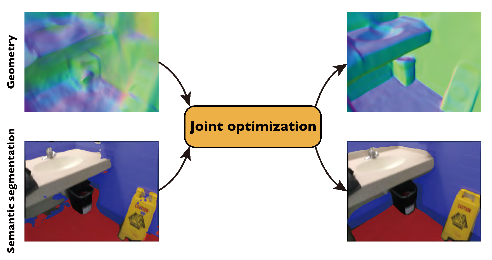

**News**

* `06/03/2022` We provide the instruction to run on custom data [here](./docs/CUSTOM.md).
* `05/10/2022` To make the comparison on ScanNet easier, we provide all quantitative and qualitative results of baselines [here](./docs/RESULTS.md#baseline-results), including COLMAP, COLMAP*, ACMP, NeRF, UNISURF, NeuS, and VolSDF.
* `05/10/2022` To make the following works easier to compare with our model, we provide our quantitative and qualitative results, as well as the trained models on ScanNet [here](./docs/RESULTS.md#our-results).
* `05/10/2022` We upload our processed ScanNet scene data to [Google Drive](https://drive.google.com/drive/folders/1LyeLuJzTH7-JWUG886gpN1WEzxGDRLm3?usp=sharing).

# Neural 3D Scene Reconstruction with the Manhattan-world Assumption
### [Project Page](https://zju3dv.github.io/manhattan_sdf) | [Video](https://www.youtube.com/watch?v=U4zmSuh31g0) | [Paper](https://arxiv.org/abs/2205.02836)
<br/>



> [Neural 3D Scene Reconstruction with the Manhattan-world Assumption](https://arxiv.org/abs/2205.02836)  
> [Haoyu Guo](https://github.com/ghy0324)<sup>\*</sup>, [Sida Peng](https://pengsida.net)<sup>\*</sup>, [Haotong Lin](https://github.com/haotongl), [Qianqian Wang](http://www.cs.cornell.edu/~qqw/), [Guofeng Zhang](http://www.cad.zju.edu.cn/home/gfzhang/), [Hujun Bao](http://www.cad.zju.edu.cn/home/bao/), [Xiaowei Zhou](https://xzhou.me)  
> CVPR 2022 (Oral Presentation)
<br/>

## Setup

### Installation
```shell
conda env create -f environment.yml
conda activate manhattan
```

### Data preparation

Download ScanNet scene data evaluated in the paper from [Google Drive](https://drive.google.com/drive/folders/1LyeLuJzTH7-JWUG886gpN1WEzxGDRLm3?usp=sharing) and extract them into `data/`. Make sure that the path is consistent with [config file](./configs/scannet/0050.yaml#L38).

We provide the instruction to run on custom data [here](./docs/CUSTOM.md).

## Usage

### Training

```shell
python train_net.py --cfg_file configs/scannet/0050.yaml gpus 0, exp_name scannet_0050
```

### Mesh extraction

```shell
python run.py --type mesh_extract --output_mesh result.obj --cfg_file configs/scannet/0050.yaml gpus 0, exp_name scannet_0050
```

### Evaluation

```shell
python run.py --type evaluate --cfg_file configs/scannet/0050.yaml gpus 0, exp_name scannet_0050
```


## Citation

If you find this code useful for your research, please use the following BibTeX entry.

```bibtex
@inproceedings{guo2022manhattan,
  title={Neural 3D Scene Reconstruction with the Manhattan-world Assumption},
  author={Guo, Haoyu and Peng, Sida and Lin, Haotong and Wang, Qianqian and Zhang, Guofeng and Bao, Hujun and Zhou, Xiaowei},
  booktitle={CVPR},
  year={2022}
}
```

## Acknowledgement

- Thanks to Lior Yariv for her excellent work [VolSDF](https://lioryariv.github.io/volsdf/).
- Thanks to Jianfei Guo for his implementation of VolSDF [neurecon](https://github.com/ventusff/neurecon).
- Thanks to Johannes Schönberger for his excellent work [COLMAP](https://github.com/colmap/colmap).
- Thanks to Shaohui Liu for his customized implementation of [COLMAP](https://github.com/B1ueber2y/colmap/tree/c84269d693246d8294307cc32f851813f18b6a2d) as a submodule of [NerfingMVS](https://github.com/weiyithu/NerfingMVS).
